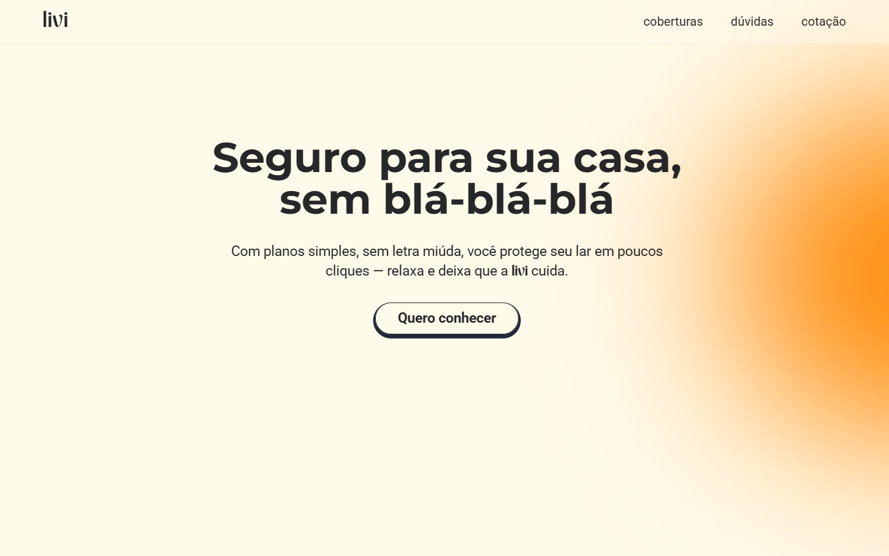

  <h1>livi</h1>

Página para divulgação de seguro residencial 

  

## Objetivo do projeto
Desenvolver um site de uma empresa de seguro residencial.
O site conterá uma home com três sessões: hero, tipos de coberturas e faq, além disso terá outra págnia com formulário para cotação.

### Etapas
v1.0 - Hero e Carrossel ✅ 
Transições e animações. 
Carrossel automático e manual.

v1.1 - Sessão FAQ 
Implementar acordeão interativo. 
Adicionar animações de abertura/fechamento.

v1.2 - Formulário de Contato 
Implementar validação de dados. 
Adicionar API de cep.

## Construído com
- HTML
- CSS
- Tailwindcss
- JavaScript
  